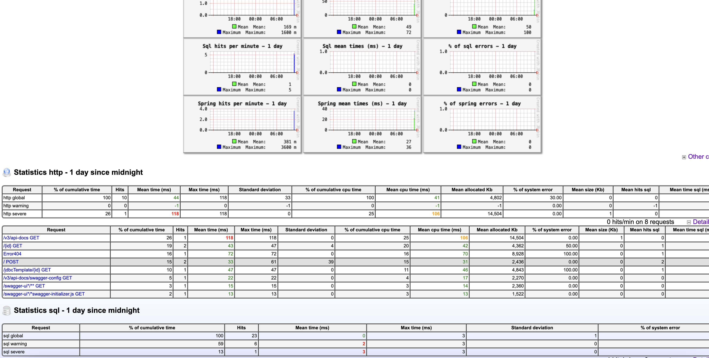

# SpringJavaMelody

## Overview

SpringJavaMelody is a project that integrates JavaMelody with a Spring Boot application. JavaMelody is a monitoring tool that helps to measure and calculate statistics on the real operation of a Java application in QA and production environments.

## Features

- **Monitoring**: Provides detailed information about the performance and health of your application.
- **Statistics**: Collects and displays statistics on HTTP requests, SQL queries, and more.
- **Alerts**: Can be configured to send alerts based on specific thresholds.

## Prerequisites

- Java 23
- Maven

When you run the application locally, you can access the JavaMelody dashboard by navigating to `http://localhost:8080/monitoring`.

Example of the JavaMelody dashboard:
